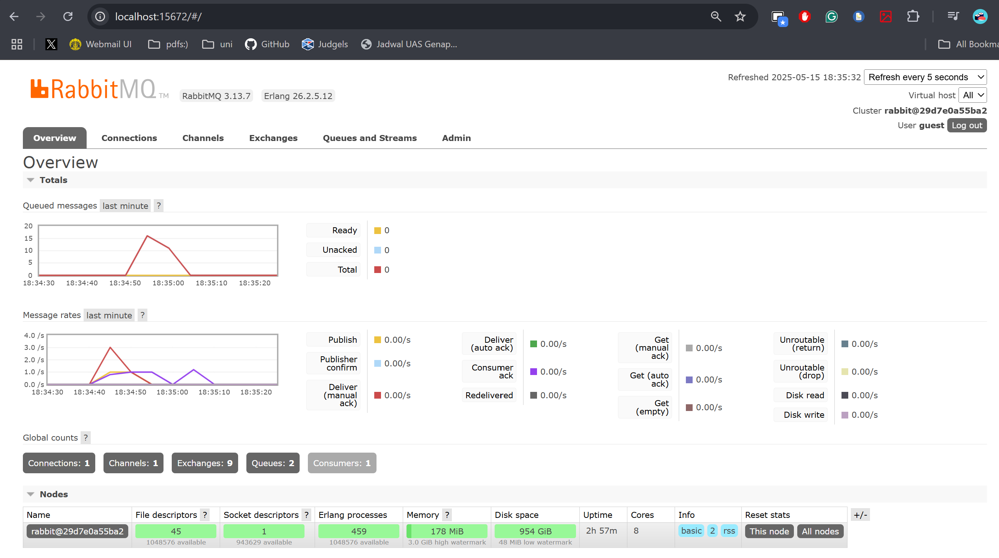
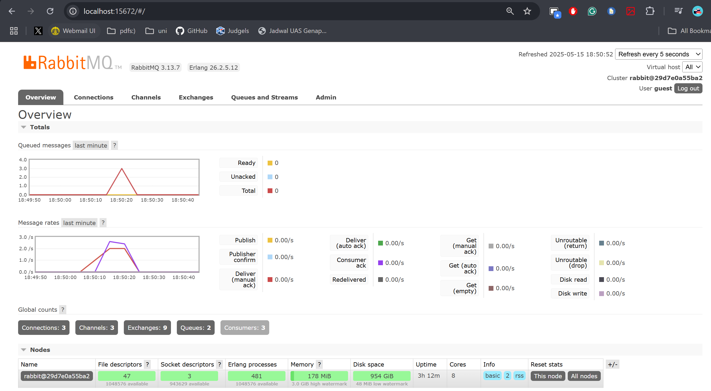

## 1. What is amqp?
AMQP is an open, standardized way for applications to send and receive messages through a broker, such as RabbitMQ. This is so that producers and consumers don’t have to worry about the delivery, routing, or retries. Utilizing AMQP ensures the data packets get where they need to go reliably.

## 2. What does it mean? guest:guest@localhost:5672 , what is the first guest, and what is the second guest, and what is localhost:5672 is for? 
The first guest is the username. The second guest is the password. localhost:5672 tells the client to connect to the broker running on our own machine (localhost) at port 5672, which is the default AMQP port.

## Simulation Slow Subscriber

The total at its peak hits 16 messages. This is because publisher sends messages faster than the consumer could grab and acknowledge. Therefore it is stacked up in the queue until the consumer caught up. 

## Reflection and Running at least three subscribers

In this run, the queue never went above three because only five messages were published in total. Therefore a hard upper limit on what could pile up was there. Other than that, the subscriber,which deliberately pauses for one second per message before immediately acknowledging it,  kept pace with that small batch. Once the publisher wrapped up the five messages, the consumer immediately processed whatever was left and cleared the queue.
